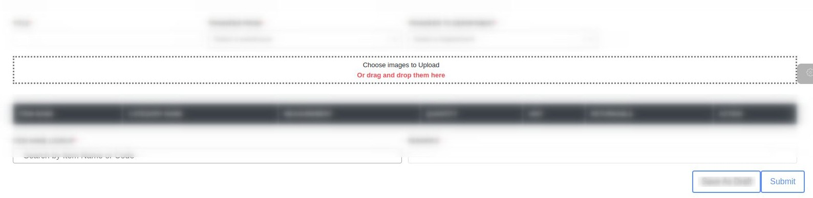
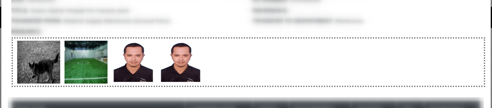

# image-gallery-uploader
Image Gallery can view, upload and update your image file.

# States
Intially the component looks like this if it is in uploading mode.

If you want to just view images -

After selecting image it will look like this in create/uploading mode -

This is an example of editing images, where you can remove and add new image also -

